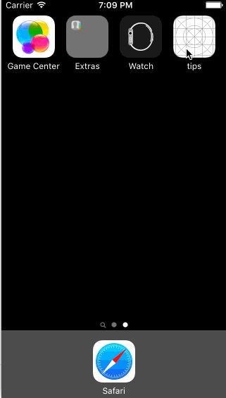

#TipCalculator

This is a Tip Calculator application for iOS submitted as the pre-assignment requirement for CoderSchool.

Time spent: 7 hours

Completed:
 * [x] Required: User can enter a bill amount, choose a tip percentage, and see the tip and total values.
 * [x] Required: Settings page to change the default tip percentage.
 
 The following **optional** features are implemented:
 * [x] UI animations
 * [x] Remembering the bill amount across app restarts (if <10mins)
 * [x] Making sure the keyboard is always visible and the bill amount is always the first responder. This way the user doesn't have to tap anywhere to use this app. Just launch the app and start typing.
 * [x] Toggle theme in settings page
 
Notes:
This only works for iPhone Retina 5s" in Portrait orientation.
Here's a walkthrough of implemented user stories:

GIF created with [LiceCap](http://www.cockos.com/licecap/).
